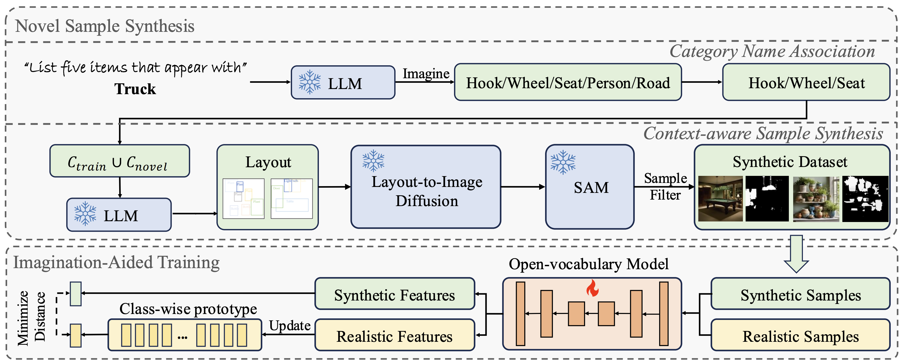
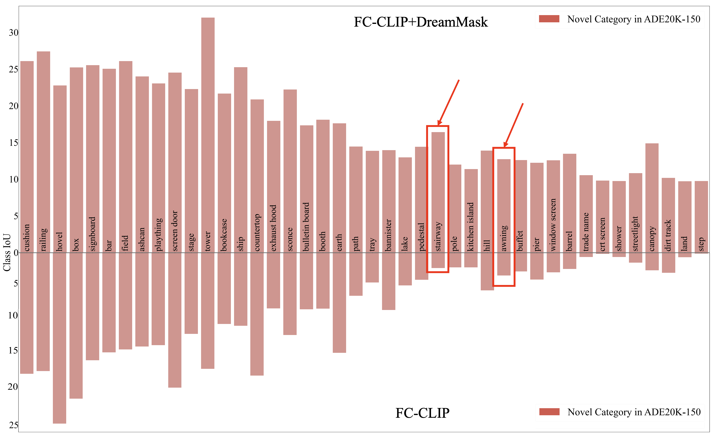
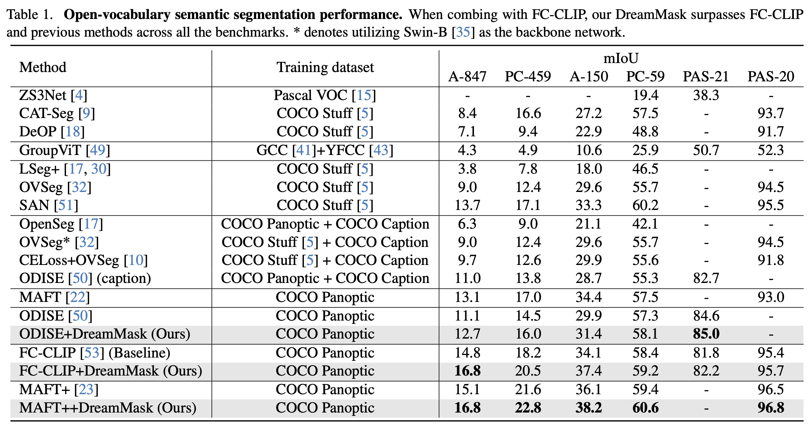

# DreamMask: Boosting Open-vocabulary Panoptic Segmentation with Synthetic Data

This repository contains the code for **DreamMask**, an imagination-aided training framework that improves open-vocabulary segmentation by combining:

- **NSS** – *Novel Sample Synthesis* using LLM + layout generation + layout-to-image diffusion.
- **IAT** – *Imagination-Aided Training* that aligns synthetic and real features on top of open-vocabulary segmentation models such as FC-CLIP.

The implementation in this repo is based on FC-CLIP / Mask2Former and is designed to be drop-in compatible with standard Detectron2 training scripts.

---

## 1. Overview

<p align="center">
  
</p>

**Novel Sample Synthesis (NSS)**  

1. Category Name Association (CNA) with an LLM to discover novel but related categories.  
2. Context-aware layout generation over \(C_{\text{train}} \cup C_{\text{novel}}\).  
3. Layout-to-image diffusion (e.g., LayoutGPT) to obtain realistic synthetic images.  
4. SAM + CLIP-based mask generation and score-based selection to filter high-quality samples.

**Imagination-Aided Training (IAT)**  

- Maintain a **real feature memory bank** per class.
- Extract CLIP features for synthetic objects and align them to real prototypes with a cosine distance loss:
  \[
  L = L_{\text{seg}} + \lambda L_{\text{sra}}.
  \]

This effectively distills “imagined” synthetic samples into the open-vocabulary model.

---

## 2. Repository Structure

```text
.
├── IAT/        # Imagination-Aided Training (model & loss, e.g. FC-CLIP + DreamMask)
├── NSS/        # Novel Sample Synthesis pipeline (CNA, layouts, masks, selection)
├── static/     # Figures used in the paper/README
│   ├── framework.png   # Method overview
│   ├── compare.png     # Per-class IoU comparison (FC-CLIP vs. FC-CLIP+DreamMask)
│   └── table.png        # Main quantitative results table
└── README.md
```

Each subdirectory may contain its own `README` with more detailed instructions (data paths, running commands, etc.).

---

## 3. Key Results

### 3.1 Per-Class Novel Category Improvements

<p align="center">
  
</p>

The figure above shows per-class IoU improvements on **ADE20K-150** novel categories when moving from **FC-CLIP** to **FC-CLIP + DreamMask**.  
Highlighted categories such as *stairway* and *awning* demonstrate substantial gains from imagination-aided training.

### 3.2 Open-Vocabulary Semantic Segmentation Performance

<p align="center">
  
</p>

DreamMask consistently improves strong open-vocabulary baselines:

- **FC-CLIP + DreamMask** outperforms vanilla FC-CLIP on all benchmarks.
- The framework is also compatible with other open-vocabulary models (e.g., ODiSE, MAFT) via the same synthetic–real alignment principle.

---

## 4. Getting Started

### 4.1 Dependencies

This project follows the environment of FC-CLIP / Mask2Former:

- Python 3.x  
- PyTorch & CUDA  
- Detectron2  
- Other dependencies: `pycocotools`, `timm`, CLIP, etc.

Please refer to the original FC-CLIP installation instructions and then install any extra packages listed in the sub-module READMEs (`IAT/` and `NSS/`).

### 4.2 Data Preparation (High-Level)

1. **Prepare COCO-style training data** for the underlying open-vocabulary model (e.g., COCO Panoptic for FC-CLIP).
2. **Run NSS** to construct the synthetic dataset:
   - Category Name Association (CNA)
   - Layout generation & layout-to-image synthesis
   - Mask generation + score-based selection  
   Details are provided in `NSS/README.md`.
3. **Prepare the processed synthetic dataset** (e.g., `processed_dataset/` with `images/`, `masks/`, `scene_*.json`) for training.

---

## 5. Training (Example: FC-CLIP + DreamMask)

Inside `IAT/` we provide a DreamMask-aware meta-architecture (`FCCLIP` with SRA loss) and a training script (e.g. `train_net_nss.py`) that:

- Registers the processed synthetic dataset as a Detectron2 instance-segmentation dataset.
- Marks every synthetic sample with `is_synthetic = True`.
- Uses our modified FC-CLIP meta-architecture to compute:
  \[
  L = L_{\text{seg}} + \lambda L_{\text{sra}}.
  \]

Typical usage (example only):

```bash
python train_net_nss.py   --config-file configs/coco/panoptic-segmentation/fcclip/fcclip_convnext_large.yaml   --num-gpus 8   OUTPUT_DIR output/nss_fcclip_convnext_large
```

Please check `IAT/README.md` for the exact commands, configuration keys (e.g. `MODEL.DREAMMASK.MEMORY_BANK_SIZE`, `MODEL.DREAMMASK.LAMBDA_SRA`) and data path settings.

---

## 6. Citation

If you find this project useful in your research, please consider citing our work (placeholder BibTeX):

```bibtex
@misc{tu2025dreammaskboostingopenvocabularypanoptic,
      title={DreamMask: Boosting Open-vocabulary Panoptic Segmentation with Synthetic Data}, 
      author={Yuanpeng Tu and Xi Chen and Ser-Nam Lim and Hengshuang Zhao},
      year={2025},
      eprint={2501.02048},
}
```

---

## 7. License

This repository is released under the same license terms as the upstream FC-CLIP / Mask2Former implementations, with additional modifications for DreamMask.
Please see the corresponding LICENSE files for details.
